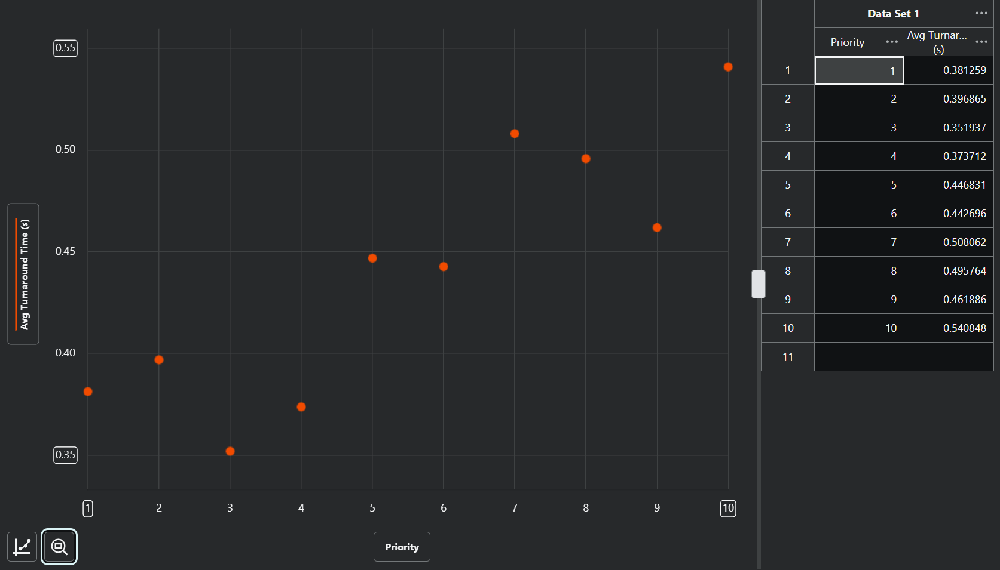

- What to report:  
1. "What values of base and scaling factors provided a good tradeoffs of the above performance metrics."  

My first thoughts on the scaling of our scaling factors:  
- The average service time we're using is 0.06 seconds. My understanding is that an ideal quantum should be such that 80-85% of processes should complete in one CPU burst, so it should perhaps be larger than the average service time. Just for testing sake, I'll try a base quantum that is lower than the average service time, equal, and higher.  

- If A is too high, we won't be adding much quantum time to high priority processes.
- If A is too low, we will be allocating too much time potentially.
- If B is too high, we'll be allocating the minimum possible quantum, and get a high number of average context switches per process.
- If B is too low, we won't be reducing the quantum for processes with a high execution time, potentially letting them monopolize the CPU.

My hypothesis is that we probably want A and B to not differ too much, nor be too large in scale. I'll try some single-digit, similar values for the two of them and see.  

First, I made A and B the same value, and tried values 1 - 10. I set the base quantum to be 0.03 seconds. Here are some results:  

> A, B = 1:  
Average turnaround time: 23603.361710 seconds  
Average number of context switches per process: 1.420200  
Average number of processes in the readyQueue: 5213.383257  

> A, B = 2:  
Average turnaround time: 11781.713460 seconds  
Average number of context switches per process: 1.405200  
Average number of processes in the readyQueue: 5137.678888  

> A, B = 3:  
Average turnaround time: 7688.032752 seconds  
Average number of context switches per process: 1.380200  
Average number of processes in the readyQueue: 5025.323338  

> A, B = 4:  
Average turnaround time: 5738.973662 seconds  
Average number of context switches per process: 1.401500  
Average number of processes in the readyQueue: 4952.941486  

> A, B = 5:  
Average turnaround time: 4497.511385 seconds  
Average number of context switches per process: 1.403300  
Average number of processes in the readyQueue: 4825.051738  

> A, B = 6:  
Average turnaround time: 3794.816305 seconds  
Average number of context switches per process: 1.381200  
Average number of processes in the readyQueue: 4788.238021  

> A, B = 7:  
Average turnaround time: 3171.714303 seconds  
Average number of context switches per process: 1.434100  
Average number of processes in the readyQueue: 4672.340185  

> A, B = 8:  
Average turnaround time: 2742.485075 seconds  
Average number of context switches per process: 1.485500  
Average number of processes in the readyQueue: 4607.254182  

> A, B = 9:  
Average turnaround time: 2404.120421 seconds  
Average number of context switches per process: 1.517600  
Average number of processes in the readyQueue: 4525.638143  

> A, B = 10:  
Average turnaround time: 2193.098936 seconds  
Average number of context switches per process: 1.510700  
Average number of processes in the readyQueue: 4480.717564  

Ok so far, we seem to be benefitting by increasing these parameters.  

Next I decided to resume having A and B the same, but increasing them by multiples of 5 from 5-50. I'll save the space from writing it all out, but we saw similar continuous improvements as A and B scaled upward. I did the same, but this time going from 5-250, and saw the same thing. In general, raising these values dereased the average turnaround time, number of context switches, and number of processes in the ready queue.  

> A, B = 250.000000  
Average turnaround time: 35.234546 seconds  
Average number of context switches per process: 3.074500  
Average number of processes in the readyQueue: 395.291298  

Still not favorable results. I decided to now differ the A and B value, as well as play around with different base quantums. I did this for a while, and I found a really good result by using a high A value, low B value, and smaller base quantum than I'd initially thought to use.  

> Base quantum = 0.020000  
A = 600.000000  
B = 0.100000  
Average turnaround time: 0.439043 seconds  
Average number of context switches per process: 3.129000  
Average number of processes in the readyQueue: 5.236419  
************************************************************  
Average turnaround times per priority:  

|PRIORITY      |Avg. Turnaround Time (sec)  |
|--------------|----------------------------|
|1             |0.381259                    | 
|2             |0.396865                    | 
|3             |0.351937                    | 
|4             |0.373712                    | 
|5             |0.446831                    | 
|6             |0.442696                    | 
|7             |0.508062                    | 
|8             |0.495764                    | 
|9             |0.461886                    | 
|10            |0.540848                    | 

************************************************************  

This was the best result I was able to get, so I'm going to stick by it. I think a high A value works well because we're scaling the division of the numerator (which will be a single digit integer) down to a relative size of our average service time, so the quantum isn't so large that we're trying to do the whole process at once. A low B works because we're establishing a penalty for long execution times, without making it either too punishing or ineffective. From my prior research it was my hypothesis that a base quantum either slightly smaller or larger than the average service time would work best, but I was proven wrong - a base quantum of a third the size of the average service time turned out to be superior.  

2. "Are there any starvation concerns? How would you tackle them."  
The only starvation concern was addressed early on in the project, when implementing the quantum calculation. A quantum either being ridiculously high or near zero/negative could potentially cause starvation or very long turnaround times. We can avoid making it too high by our prior selection of optimal base quantum, A, and B parameters, and I kept it from going near-zero by implementing a minimum quantum of 0.01 second.  

3. "Show a graph between priority and turnaround time."  
Using the above listed table, here is a graph generated from those findings.  

This is interesting - there's certainly a linear correlation where "more important" priorities have a lower average, but it's a bit rocky. I suppose that has to do with the small overall timescale, as the correlation was much "smoother" when I had much worse times before figuring out optimal base quantum, A, and B parameters.  

4. "Based on your recommended values, how this scheduler compares to a vanilla RR with the base
   quantum."  

We can simulate a vanilla RR by setting the A parameter very high, and the B parameter to zero. I did so, and here were my findings:  

> Base quantum = 0.020000  
A = 600.000000  
B = 0.000000  
Average turnaround time: 0.637034 seconds  
Average number of context switches per process: 2.606100  
Average number of processes in the readyQueue: 7.540013  
************************************************************  
Average turnaround times per priority:  

|PRIORITY      |Avg. Turnaround Time (sec)  |
|--------------|----------------------------|
|1             |0.535289                    | 
|2             |0.547747                    | 
|3             |0.587328                    | 
|4             |0.604047                    | 
|5             |0.625975                    | 
|6             |0.597568                    | 
|7             |0.655815                    | 
|8             |0.689146                    | 
|9             |0.690609                    | 
|10            |0.846047                    | 

************************************************************  

I ran things like this a good number of times, with an average turnaround time of around 0.6 seconds. I did the same with my prior (optimal) parameters, and found an overall average of around 0.45 seconds. This would lead me to believe that having the adjustable quantum like this is certainly better, by around 25% when comparing average turnaround times.  